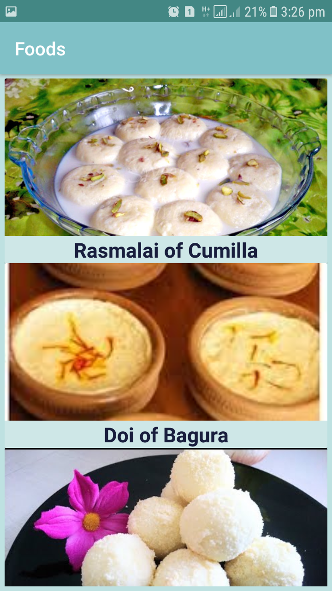

# MyWay
(An android application project)

## Introduction
This apps will work as a medium to connect the customers with the workers to buy or send a parcel. There are many companies to deliver parcel and there are also many online shopping agencies. But it takes time to deliver product. Sometimes one or two days. In that case we are really unable to buy perishable products. Sometimes we want our product as early as possible. This is why we need this apps. Here the workers are nothing but travellers who wants to carry product and deliver to the customer on their way. So, it will take much less time as well as both worker and customer will be benefited.

## Tools
- Android Studio 3.2.1
- Firebase (Database)
- Java (Language)

## Prerequisites
Minimum SDK Version 21

## Description

### Signing Process
At first user has to register with email address, password, name and phone no. Then verification mail will be sent on given email address.

  &nbsp;&nbsp;&nbsp;&nbsp;&nbsp;&nbsp;&nbsp;&nbsp;  &nbsp;&nbsp;&nbsp;&nbsp;&nbsp;&nbsp;&nbsp;&nbsp;    

After verification user will be able to log in his/her account.

  &nbsp;&nbsp;&nbsp;&nbsp;&nbsp;&nbsp;&nbsp;&nbsp;  &nbsp;&nbsp;&nbsp;&nbsp;&nbsp;&nbsp;&nbsp;&nbsp;   

##### Forgot Password
User can reset password. He/she has to type mail address and password reset email will be sent to that address. Then user can set new password. 

 &nbsp;&nbsp;&nbsp;&nbsp;&nbsp;&nbsp;&nbsp;&nbsp;  &nbsp;&nbsp;&nbsp;&nbsp;&nbsp;&nbsp;&nbsp;&nbsp;   

 ### Homepage
In this page products will be displayed. Sellers can display their product here and also famous products of various area will be displayed here. User can rate this products also. 

 &nbsp;&nbsp;&nbsp;&nbsp;&nbsp;&nbsp;&nbsp;&nbsp;  &nbsp;&nbsp;&nbsp;&nbsp;&nbsp;&nbsp;&nbsp;&nbsp;    
 

##### Profile
User profile will display user name, photo, email address, and phone no. User will be able to change their profile picture.

  

##### Parcel
It will show user with red marker and available workers in 3km with green marker.

  &nbsp;&nbsp;&nbsp;&nbsp;&nbsp;&nbsp;&nbsp;&nbsp;  &nbsp;&nbsp;&nbsp;&nbsp;&nbsp;&nbsp;&nbsp;&nbsp;   

By clicking on green marker user can see worker name and phone no. By clicking on this user can make call to a specific worker. To make call apps will ask for permission.

  &nbsp;&nbsp;&nbsp;&nbsp;&nbsp;&nbsp;&nbsp;&nbsp;  &nbsp;&nbsp;&nbsp;&nbsp;&nbsp;&nbsp;&nbsp;&nbsp;   

User can also search for a specific location. 

   

##### Work
If user want to register as worker then he/she has to confirm here.
After signing in as worker he/she will be able to sign out as worker. After then he/she will be no longer a worker but may signed in as normal user.

  &nbsp;&nbsp;&nbsp;&nbsp;&nbsp;&nbsp;&nbsp;&nbsp;  &nbsp;&nbsp;&nbsp;&nbsp;&nbsp;&nbsp;&nbsp;&nbsp;   

##### Settings
 
* About
  * Here he/she can learn about terms and conditions
* Update Password
  * User can update password
  
     
   
* Delete Account
  * User can also delete his/her account. After then if he/she want to join again then he/she has to register again
  
    
  
  ## Future Work
  I've many plans on this project. I want to improve rating system and to add payment method. I also want to connect sellers with this apps and their payment method. So, a lot of works to do here.
  
  ## Conclusion
  I hope this apps will be user friendly. As users can get their service here in the earliest time of any other systems, they must love this apps. On the other hand, worker can make some money in their travelling time. Sellers will be benifited also as their rate of sale will be increased. So, we can hope that this apps will make our life easier and everyone connected with this apps is going to love this product.
